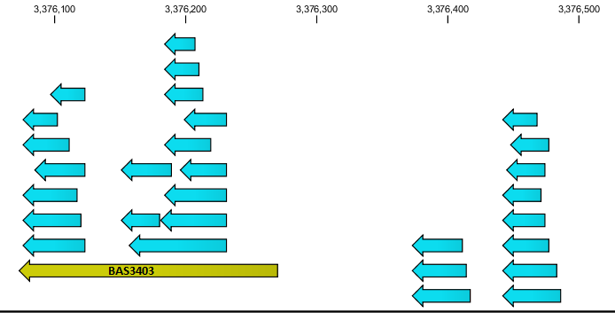

Automated Proteogenomics Pipeline for MPI clusters, high-througput batch clusters and multicore workstations
========================================================================

The open source, automated proteogenomics pipeline (PGP) described here is freely accessible to the scientific community. It is designed to run in different kinds of parallel Linux computing environments:

- HPC (high-performance computing) clusters that are set up to efficiently schedule only large (100s+ of cores) parallel MPI jobs under a control of batch queuing system such as (formerly) Sun Grid Engine (SGE), SLURM or PBS/Torque. Our primary targets for this use case were compute clusters of XSEDE ([https://www.xsede.org/][1]), the federation of supercomputers supported by the US National Science Foundation. XSEDE allocates its resources to outside researchers through a peer reviewed proposal system. We considered it as an important requirement that the biologists could use our software on this major computational resource.

- HTC (high-throughput computing) clusters widely used as local bioinformaics computing resources. These clusters are configured to efficiently schedule large numbers of serial jobs under a control of batch queuing system.

- A single multi-core workstation without a batch queuing system (including a case of single core machine).

Parallel execution ability is important for proteogenomic annotation software due to a high volume of required computations \(order of XXX CPU*hrs for a typical bacterial genome\).

###Value of proteogenomic annotation
Our pipeline is a tool for improving the
existing genomic annotations from available proteomics mass
spectrometry data. As most genome annotation pipelines consist of automated gene finding, they lack experimental validation of primary structure [[PMC2265698](http://www.ncbi.nlm.nih.gov/pmc/articles/PMC2265698/), [PMC2238897](http://www.ncbi.nlm.nih.gov/pmc/articles/PMC2238897/)], having to rely on DNA centric sources of data such as sequence homology, transcriptome mapping, codon frequency, etc. By incorporating the orthogonal set of data, proteogenomics is able to discover novel genes, post-translational modifications (PTMs) and correct the erroneous primary sequence annotations.

Quick Start
-----------
To test the pipeline, you can run it on a single workstation (preferably multicore one).

Make sure that your are in a directory where you have write access and enough free space (20G).

Follow the Installation instructions below, using the installation command: `<path to checked out source>/config/installPGP.sh -e htc -r PGP`

The pipeline should get installed into a directory PGP in your working directory.

Download and unpack sample input directory with reduced (subsampled) spectra data.

Execute:
    
    sh PGP/proteogenomics/config/run.PGP.htc.sh Cyanobacterium.synechocystis.PCC6803  Cyanobacterium.synechocystis.PCC6803.results -t local

Check Cyanobacterium.synechocystis.PCC6803.results/GFFs to make sure that there are output GFF3 files where. You can load the GFF3 files and corresponding reference from Cyanobacterium.synechocystis.PCC6803/Databases/Genomic into any of the genomic browsers such as NCBI Genome workbench,
Artemis or CLC Genomics workbench in order to check the newly created annotations visually.

I). The PGP Algorithm
----------------------

The full protocol of our pipeline is described in detail in  [[PMC3219674](http://www.ncbi.nlm.nih.gov/pmc/articles/PMC3219674/)]. In that study, we have applied the pipeline to 46 genomes spanning eight bacterial and archaeal phyla across the tree of life. These diverse datasets facilitated the development of a robust approach for proteogenomics that is functional across genomes varying in %GC, gene content, proteomic sampling depth, phylogeny, and genome size. In addition to finding evidence for 682 novel proteins, 1336 new start sites, and numerous likely misannotations, we discovered sites of post-translational maturation in the form of proteolytic cleavage of 1175 signal peptides. The output files from this study are available at ([http://omics.pnl.gov/pgp/overview.php][2]).

The pipeline combines the open sources proteomics tools from ([http://proteomics.ucsd.edu][3]) with our own post-processing steps.

Briefly, tandem mass spectra are searched by Inspect [PMID:16013882] against a translation of the genome and subsequently rescored with PepNovo [PMID:15858974] and MSGF [PMID:18597511]. The pipeline  translates the DNA sequence in all six frames to generate a reference protein database.

Each stop to stop open reading frame (ORF) is included regardless of
coding potential. The concatenated decoy records for estimating the statistical significance of the predicted peptides are generated by shuffling each ORF.
Significant peptide/spectrum matches (PSM) are those with a pvalue of
e-10 or better, which leads to a peptide level false discovery rate of ~0.3%. All confident peptides are mapped onto their genomic location
(nucleotide coordinates) and grouped into sets within an ORF. 

The last stage of the pipeline employs five ORF filters. First, we remove low complexity peptides and peptides which are more than 750 bp from the next in-frame peptide. We remove ORFs which lack a uniquely mapping peptide or which lack a fully tryptic
peptide. Finally, we require two peptides per protein.

Peptides from ORFs which meet all of the above criteria are saved in the output GFF3 files in coordinates relative to the reference genome. The user can load these files into genomic browsers such as NCBI Genome workbench or Artemis for subsequent analysis.

### Example of interpreting the output

Peptides mapping to regions of the genome which lack a protein
annotation represent either novel genes, or 5' extensions of current
genes. For example, at 3.376 MB in the B. anthracis Sterne genome lies
the BAS3403 gene, the small spore protein Tlp. Many peptides from this
protein were discovered by the pipeline. In the open reading frame
directly upstream, the protocol detected other peptides which were not part of any currently annotated protein. Blasting this ORF revealed homology to another spore coat protein from B. cereus, not annotated
in any anthrax genome.

II). Installation
-----------------

**A).** Dependencies

The integrated installation procedure needs the following tools to be present on the system: 

> - *Git* to checkout the source from the public repository on BitBucket ([https://bitbucket.org/andreyto/proteogenomics][4])
> - *Wget* to download dependencies
> - *BASH* shell
> - C++ compiler (gcc or MPI wrappers, depending on the targeted execution environment), Python development libraries and Boost Python
> interface library are needed to build and install the pipeline Python
> extension modules, compiled executables and Makeflow workflow engine
> - You can modify the installation procedure to use, for example, other means of getting the sources to your target system, in which case you
> will not need Git.

For run-time, you will need:

> - Java, Python, Boost Python shared libraries
> - MPI environment if MPI backend if used for execution

**B).** ***installPGP.sh*** : This is a script that attempts to automatically install the package and other dependencies required by the pipeline, 

  i). download the ***installPGP.sh*** script
(wget --no-check-certificate  [https://bitbucket.org/andreyto/proteogenomics/raw/HEAD/config/installPGP.sh][5]),

  ii). make it executable (`chmod +x installPGP.sh`) 
  
  iii). run it from a directory of your choice ("working directory")
as shown below under **Usage**. It only needs to be run once. The
directory in which the software is installed by the ***installPGP.sh*** is
referred to as **PGP\_ROOT** in the document and the script. The PGP
code itself will be in **'proteogenomics'** subfolder (**PGP\_HOME**). All the
configuration files needed to set the environment for running the
pipeline reside in the **config** subdirectory (**config\_dir**) under
PGP\_HOME.

**Usage:** ***installPGP.sh -h***

The options defining the cluster environment and the path to the
installation directory must be provided as indicated below.

OPTIONS:

-h help message

-e computing environment name (‘ranger’ is the environment configured for XSEDE Ranger cluster; 'generic' covers both HTC clusters and multi-core workstations). The computing environments are discussed in detail below.

-r the installation directory (PGP\_ROOT)

**example:**

    installPGP.sh -e ranger -r <path to PGP_ROOT>

-   When the script exits successfully after installing the software, it will print messages to standard output, informing what to do to next for executing the pipeline.

III). Running the pipeline
--------------------------

We achieve the portability across different parallel execution environments by using the Makeflow workflow execution engine ([http://nd.edu/~ccl/software/makeflow/][6]). Makeflow also provides a high degree of fault tolerance against compute node failures (in non-MPI execution mode) and restart capability in case of master node failure. 

Our installation procedure builds its own local copy of the CCTools package that contains Makeflow and associated backend executables.

Given a directory with input data, our pipeline's code generates a description of the workflow (in a language that is based on the `make` file format). Makeflow can then execute this workflow using different parallel "backends" selected by the user at run-time. For example, Makeflow supports execution of complex workflows composed of many interdependent serial jobs on large MPI clusters through a "glide-in" mechanism. The user submits the MPI backend executable of Makeflow as a single parallel MPI job (e.g. with 100 ranks). Then, the user starts the Makeflow master on a single node. The individual MPI process ranks connect to the master, and the master farms out single serial tasks to the ranks following the order of workflow dependencies. 

When the user selects "ranger" installation environment, our pipeline instantiates several scripts that make it more simple for the user to execute the pipeline under the MPI Makeflow backend described above. TACC Ranger was the XSEDE cluster where we have tested the MPI execution mode. At build time, the "ranger" option also uses "module" commands to make available the proper dependencies such as MPI compilers for building Makeflow as well as Boost libraries. "Module" command is a standardised user environment management script used by XSEDE clusters ([https://www.xsede.org/software-environments][7]). The users will have to modify the details of specific package versions activated my the "module" command in order to adapt the building and execution environment to their specific XSEDE cluster. 

Using other Makeflow backends such as SGE serial job submission or multicore workstation is much more simple, and those cases are covered by the sample execution scripts instantiated when "generic" environment is selected during installation. The users can always modify the parameters of Makeflow execution and backend job submission following Makeflow User Manual ([http://www3.nd.edu/~ccl/software/manuals/makeflow.html][8]), possibly using our scipts as the starting point. Our scripts have extensive annotations in inline comments. Some site-specific tuning of job submission scripts will likely to be required on any computational cluster, considering the multitude of customizations of both the operating and batch systems that cluster administrators typically employ.

At high level, the pipeline execution consists of two stages. The first, serial stage prepares the input data and generates the workflow file for the second stage. The second stage performs the analysis in multiple parallel processes (with some internal barrier synchronisation steps, for example, for computing the *p-values*). Because scheduling policies and node availability are typically vastly different between serial and parallel jobs on MPI clusters like XSEDE systems, we have given to the user the control over launching these two stages as described below.

**A). Data Requirements: Genomic & Proteomic Data.**

1). Annotated nucleotide (mandatory) and protein (optional) sequence
files (e.g. **gbk**, **fna** and **faa** RefSeq files from NCBI ([http://www.ncbi.nlm.nih.gov/refseq/][9])).

2). Mass spectrometric data (spectra) in mzxml format (mzXML conversion tools can be found at
[http://tools.proteomecenter.org/wiki/index.php?title=Formats:mzXML][10]),

**B). Structured Input Data Directory:**

1). The input data mentioned under **'A'** should be organized in a
specific directory structure as shown by the listings of the directories below. This can be easily accomplished by uncomressing the `template.directory.tar.gz` provided in the data subdirectory of the
proteogenomics folder (PGP\_HOME) downloaded by the pipeline. Assuming the annotated genomic data comes from speciesX, uncompress the template directory inside speciesX folder:

    user@assembly [\~/speciesX]% ls -l

    total 32

    drwxr-x--- 5 user tigr 4096 Aug 30 12:01 Databases

    drwxr-x--- 3 user tigr 4096 Aug 30 12:01 DerivedData

    drwxr-x--- 2 user tigr 4096 Aug 30 12:01 OrthologyClusters

    drwxr-x--- 3 user tigr 4096 Aug 30 12:01 PeptidomeSubmission

    drwxr-x--- 2 user tigr 4096 Aug 30 12:01 Publications

    drwxr-x--- 2 user tigr 4096 Aug 30 12:01 RawZips

    drwxr-x--- 4 user tigr 4096 Aug 30 12:01 RefSeqSubmission

    drwxr-x--- 2 user tigr 4096 Aug 30 12:01 mzxml

2). Put your RefSeq fna and gbk files for speciesX into
`Databases/Genomic` folder and faa file(s) - into
`Databases/Predictions` folder. Any additional protein databases including common contaminants such as trypsin and keratin (but not the DNA), which also need to be searched with Inspect, go into the `Databases/Proteomic` folder. The template directory already has some
unpacked Common.RS files in this directory (as shown below).

    user@assembly [\~/tmp/db/Databases]: [12:07:22]% ls -l

    total 12

    drwxr-x--- 2 user tigr 4096 Feb 19 2010 Genomic

    drwxr-x--- 2 user tigr 4096 Feb 19 2010 Predictions

    drwxr-x--- 2 user tigr 4096 Feb 19 2010 Proteomic

    ./Genomic:

    total 0

    ./Predictions:

    total 0

    ./Proteomic:

    total 16

    -rw-r----- 1 user tigr 1472 Feb 19 2010 Common.RS.index

    -rw-r----- 1 user tigr 8254 Feb 19 2010 Common.RS.trie

3). Your spectra mzxml file(s) should be compressed in gz tar format and placed in the `mzxml` directory.

4). The remaining empty directories (some optional) serve as
placeholders to be populated by the data generated during the analysis. Some of them are the suggested locations for the last, manual curation stages of the proteogenomic re-annotation process aimed to culminate in the submission of results to NCBI Peptidome and RefSeq as described in the pipeline protocol publication []. If the user is only interested in the results of the automatic annotation but not in the NCBI submission, those directories can be ignored.

**DerivedData** - copied from output directory (see below). Specific
files or results that should be produced with every dataset

**GFFs** - a sub-directory copied from output directory (see below) -
contains the gff file with peptide annotations for the genome

**OrthologyClusters** - folder with MSA (multiple sequence alignments)
of orthologous clusters from related organisms

**Publications** - if there are relevant publications related to the
data, they go here.

**RawZips** - holds the raw Inspect and PepNovo rescored data in bz2
files

**PeptidomeSubmission** – the Peptidome submission needs meta data file, PSM results file, spectra & the results file - as explained as below.

**Peptidome** data generation: meta data generated by the user

**PepXML** - these are pepXML conversions of Inspect's output (PSMs)

**mzxml** - spectra files (mzXML.tar.gz)

**ProteinInference** - the protein inference as made by the PGP script

**RefseqSubmission** - originals submitted - contains new annotations generated by the PGP

**C). Preparation of Data & the Workflow (prepPGPdata.*.qsub):** 

In this step, the input data for the pipeline are prepared and a workflow specifying the various PGP analyses to be executed on the target distributed computed environment is generated.

Copy a proper prepPGPdata.*.qsub template script to your working directory and edit it to reflect your actual data location and batch system parameters as per the instructions below. For example, `prepPGPdata.ranger.qsub` would a template to use on XSEDE cluster. `prepPGPdata.generic.qsub` would be the template for a high-throughput SGE cluster or a workstation without a batch system. Modify a script accordingly if you have a different batch system or different OS configuration.

Make sure to do the following before executing the qsub script (substitute actual location for `config_dir` below:

a) `source config_dir/pgp_makeflow_env_master.sh`
    
b) For example, SGE-specific options `-A (account name), -pe (number of nodes and cores), -l h_rt (requested
run-time)` have to be properly modified in the qsub script on a XSEDE cluster; 

c) values for INPUT (--input-dir path for input directory in the format described above) and OUT
(--work-dir path for output results) are set in the qsub script. These are MANDATORY.

**Usage**:

Submit the job to your batch system. In case of SGE or PBS, it will look like:

    qsub prepPGPdata.ranger.qsub
    
Alternatively, you can simply execute this script locally on your current node (assuming that the file system is mounted identically across the cluster or you intend to execute the entire pipeline on that node). In that case you do not have to edit any batch system related options inside the script.

    sh prepPGPdata.ranger.qsub

-   After successful execution of the qsub script, the **log** file
    should contain the instructions (at the end) needed for running the next qsub script (runPGP.ranger.qsub) for PGP analysis.   
      

**D). Running the Analysis (runPGP.*.qsub):** This qsub script
performs the actual proteogenomics analysis and the post-processing of
the resulting data according to the workflow generated in the previous
step. Copy a corresponding script (`runPGP.ranger.qsub` or `runPGP.generic.qsub`) to your working directory and modify the options inside the script to fit your execution environment.

**Note:** Make sure to do the following before
executing **runPGP.*.qsub** script:

a) `source config_dir/pgp_makeflow_env_master.sh` 

b) SGE-specific options `-A (account name), -pe (number of nodes and cores), -l h_rt (run-time
requested)` are properly modified in the qsub script. These are MANDATORY. 

c) change directory (‘cd’) to `--work-dir/<speciesX>` (as defined in the previous qsub script `prepPGPdata.ranger.qsub`. 

**Usage:**

`qsub <edited script location>/runPGP.ranger.qsub`

-   if the script is executed successfully, the results of the analysis
    are written to --work-dir/speciesX ( --work-dir = OUT variable as
    defined in prepPGPdata.ranger.qsub).

IV). Results
------------

**Structured Output Data Directory:** When the PGP analysis is complete,
in addition to some log files, the following directories are created in
–work-dir/speciesX directory.

**Databases:** the 6-frame translated refseq genomic data copied from
input directory.

**mzxml:** MS spectral data copied from input directory.

**DerivedData:** contains the proteogenomics analysis results and
various reports for each input dataset.

**GFFs:** a sub-directory with the gff file containing peptide
annotations of the genome generated from mapping the proteomics spectra. **This can be considered the main output of the pipeline.** See [] regarding the interpretation and downstream use of these annotations.

**ResultsX:** the directory contains results from Inspect analysis.

**pepnovo:** the directory contains results from PepNovo analysis.

**pvalue10H:** the sub-directory with the output of PValue.py (with -p
0.1, -H).

**msgfOfPepnovo:** the sub-directory with the output of MS\_GF
validation.

**jobs, Done, output:** other directories with pipeline working data
(could be empty).

V). Testing
-----------

We have created a sample archive of an input directory completely populated with spectra and genomic data for *Cyanobacterium synechocystis PCC6803*. You can download it **wget URL**, unpack with `tar -xzf` and supply the path of the resulting directory as input to the pipeline. Note that this is a real size dataset, and it will take about 100 CPU*hrs to process it.

  [1]: https://www.xsede.org/
  [2]: http://omics.pnl.gov/pgp/overview.php
  [3]: http://proteomics.ucsd.edu
  [4]: https://bitbucket.org/andreyto/proteogenomics
  [5]: https://bitbucket.org/andreyto/proteogenomics/raw/HEAD/config/installPGP.sh
  [6]: http://nd.edu/~ccl/software/makeflow/
  [7]: https://www.xsede.org/software-environments
  [8]: http://www3.nd.edu/~ccl/software/manuals/makeflow.html
  [9]: http://www.ncbi.nlm.nih.gov/refseq/
  [10]: http://tools.proteomecenter.org/wiki/index.php?title=Formats:mzXML